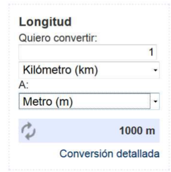

# Practica de Web Services con .NET y C#

Ejemplos resueltos de como utilizar Web Services en .Net .

## 🛠️ Construido con :

* [Visual Studio 2019](https://visualstudio.microsoft.com/es/vs/) 
* [C#](https://docs.microsoft.com/es-es/dotnet/csharp/tour-of-csharp/) 
* [Typora](https://www.typora.io/) -  archivo Readme.md

## ✒️ Autor

**Sebastián Echazú** 

* [WebSite](https://sebastianechazu.com/)
* [Github](https://github.com/SebastianEchazu)
* [Facebook](https://www.facebook.com/sebastian.echazu.1)
* [Instagram](https://www.instagram.com/seba_storm)
* [Twitter](https://twitter.com/seba_storm)

1. Codifique el siguiente formulario en una página aspx: 

   

#####  Escala de Conversión 

1 Kilometro equivale a: 

- Kilómetro 1
- Metro 1000 
- Decímetro 10000
- Centímetro 100000
-  Milímetro 1000000 
- Micrómetro 1000000000  

Micrometro equivale a: 

- Micrómetro 1
- Milímetro 10-3
- Centímetro 10-4
- Decímetro 10-5 
- Metro 10-6
- Kilómetro 10-9 
- 

2. Agregue al proyecto una clase Convert.asmx la cual contenga todo el código necesario para realizar la conversión entre cualquiera de las unidades de longitud indicadas anteriormente. 3. Implemente en la página aspx el código necesario para realizar la comunicación con el método de conversión del Servicio Web desarrollado en el punto anterior y verifique que se realicen correctamente las conversiones entre las distintas Longitudes.  

---

## 🎁 Expresiones de Gratitud 

* Comenta a otros sobre este proyecto 📢
* Invita una cerveza 🍺 o un café ☕ al autor.  🤓. 

---
⌨️ con ❤️ por [Sebastian Echazu](https://github.com/SebastianEchazu) 😊

---
